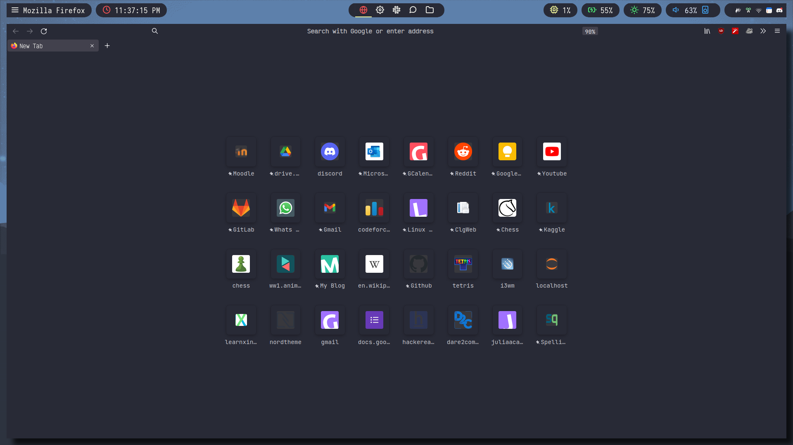

# firefox-css

## Preview



## Communities

- [r/FirefoxCSS](https://www.reddit.com/r/FirefoxCSS/)

## Installation

- Type this is address bar - `about:config`
- Search for this `toolkit.legacyUserProfileCustomizations.stylesheets` and set it to `true`.
- Search for this `browser.compactmode.show` and set it to `true`.
- Click on `Menu` `->` `More Tools` `->` `Customize Toolbar`, at the bottom panel click `Density`
  and Choose `Compact (not supported)`, click `Done`
- Type this in the address bar - `about:support` 
- Now search for `Profile Directory`, and open that directory.
- Now create a folder named `chrome` (if it is not present) and copy the `useChrome.css` and `useContent.css` form my repo there.1
- Modify the font with what you like in the `userChrome.css`

## Common issues

- wired shadow when using picom compositor - add `"class_g = 'Firefox' && argb"` to `shadow-exclude` list in picom config.


## Tricks and Tips to make your own stylesheet for firefox

### Tutorial : How to create and live-debug `userChrome.css`

Since there is no real help or documentation how to style the new Firefox Beta 57 I found a way how to live-debug the userChrome.css file.

- Create the `userChrome.css`
  - Enable `userChrome.css` support in Fx v69+
  - Open about:support
  - Click on "Profile Folder" -> "Open Folder"
  - Create a sub-folder named "chrome"
  - Change into the new folder
  - Create a file named `userChrome.css`
  - Add some rules
  - Restart Firefox

#### Live-Testing styles

##### Pre-setup

Before being able to try styles, you need to enable two developer options (only do this once). To do that:

- Press `Ctrl + Shift + I` on Win/Linux or `Cmd + Opt + I` on Mac
- Click on the cog that appears in a right or left top corner, next to other buttons.
- Scroll down to Advanced Settings and check the settings "Enable browser chrome and add-on debugging toolboxes" and "Enable remote debugging".
- Close the developer tools panel and proceed with next tutorial

##### Testing a style

- Press Ctrl + Alt + Shift + I on Win/Linux or Cmd + Opt + Shift + I on Mac
- A permission dialog will prompt you to allow remote debug, accept
- Click on the tab Style Editor, choose file userChrome.css on the sidebar
- Choose the style you want to preview from this repository, copy the code
- Scroll down on the development tools window textbox, paste the code
- You should see the style being applied. If you like what you see, you can click Save, otherwise it will disappear after restarting the browser.

#### Styling Context Menus / Popups

The Firefox dev tools, when they're opened for remote debugging of the browser content, have an extra option that's hidden behind the dropdown at the top right, a thing which many people have no clue about.
The toggle is called Disable Popup Auto-Hide and it does exactly what it says. By default Firefox (popup) menus disappear when you use the element picker, but you can make them stay around by activating this setting. This makes finding elements and their ids or classes much simpler.

Reference:
- https://developer.mozilla.org/en-US/docs/Tools/Browser_Toolbox
- https://developer.mozilla.org/en-US/docs/Tools/Style_Editor

- want the popup menus to stay open until you press `esc`
  1. type `about:config` in the url
  2. search for `ui.popup.disable_autohide` and change its value to true

## Other things you should do

- Use darkreader extension, and stylus extension for custom stylesheets.
- Make you own home page. To set it as a new tab page
  go to the firefox install directory and make a file `autoconfig.cfg`
  and copy this in it, and change the `newTabURL` with you own.
```
// mozilla.cfg needs to start with a comment line
var {classes:Cc,interfaces:Ci,utils:Cu} = Components;
/* set new tab page */
try {
  Cu.import("resource:///modules/AboutNewTab.jsm");
  var newTabURL = "file:///home/totoro/.startpage/index.html";
  AboutNewTab.newTabURL = newTabURL;
} catch(e){Cu.reportError(e);} // report errors in the Browser Console
```
